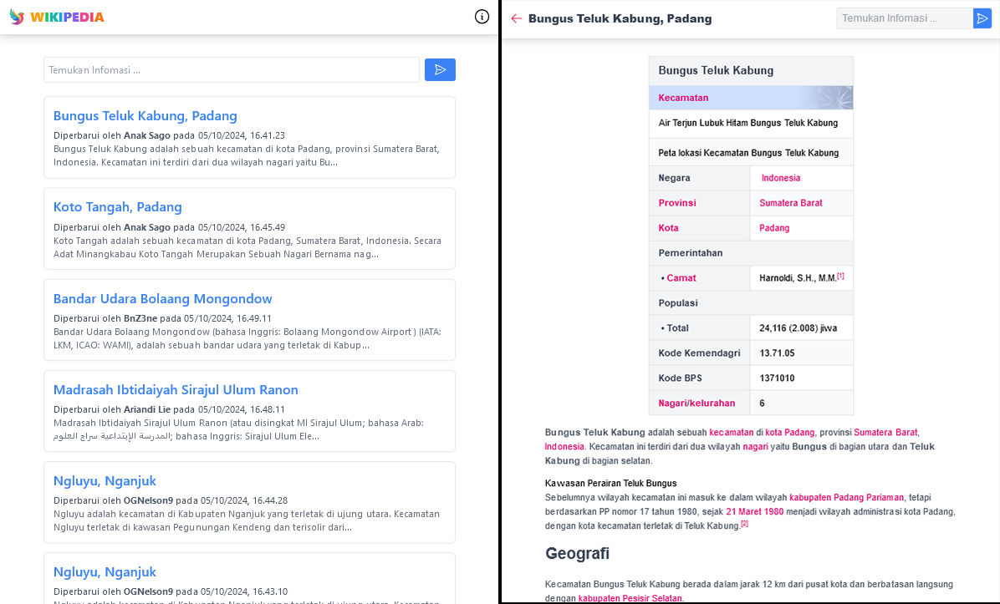

# Dokumentasi API Wikipedia



### URL Dasar
```
http://localhost:3000.com/
```

## Endpoint

### Mengambil Artikel Terbaru

- Endpoint: `api/articles`
- Metode: `GET`
- Deskripsi: Mengambil daftar artikel terbaru dengan deskripsi singkat.

**Parameter Query:**

- `page` (opsional): Nomor halaman untuk pagination (default adalah 1).

**Respons:**

```json
{
    "articles": [
        {
            "type": "string",
            "ns": int,
            "title": "string",
            "user": "string",
            "timestamp": "datetime",
            "comment": "string",
            "snippet": "string"
        }
        Lainnya ...
    ],
    "page": 1,
    "hasMore": true
}
```

**Contoh Permintaan:**

```bash
GET /api/articles?page=1
```

### Mencari Artikel

- Endpoint: `api/search`
- Metode: `GET`
- Deskripsi: Mencari artikel berdasarkan kueri yang diberikan.

**Parameter Query:***

- `q`: String kueri pencarian (wajib).
- `page` (opsional): Nomor halaman untuk pagination (default adalah 1).

**Respons:**

```json
{
    "articles": [
        {
            "ns": int,
            "title": "string",
            "pageid": int,
            "size": int,
            "wordcount": int,
            "snippet": "string",
            "timestamp": "datetime"
        }
    ],
    "page": 1,
    "hasMore": true,
    "searchQuery": "contoh"
}
```

**Contoh Permintaan:**

```bash
GET /api/search?q=contoh&page=1
```

### Mengambil Detail Artikel

- Endpoint: `api/article/:title`
- Metode: `GET`
- Deskripsi: Mengambil konten detail untuk artikel tertentu.

**Parameter Jalur:**

- `title`: Judul artikel (wajib, harus di-URL-encode).

**Respons:**

```json
{
    "title": "string",
    "content": "string"
}
```

**Contoh Permintaan:**

```bash
GET /api/article/judul_artikel
```

**Respons Kesalahan**

Jika terjadi kesalahan, API akan merespons dengan objek JSON yang berisi pesan kesalahan:

```json
{
  "error": "Pesan kesalahan yang menjelaskan masalah"
}
```

**Catatan**

- Pastikan untuk melakukan URL-encode pada judul artikel dalam permintaan untuk menghindari masalah dengan spasi dan karakter khusus.
- Pagination diterapkan pada endpoint `/articles` dan `/search`, pastikan untuk memeriksa bidang hasMore untuk menentukan apakah data lebih lanjut tersedia.
 
## Instalasi

```bash
git clone https://github.com/fitri-hy/wikipedia-clone-nodejs.git
cd wikipedia-clone-nodejs
npm install
npm start
```
